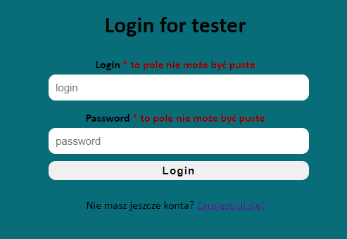
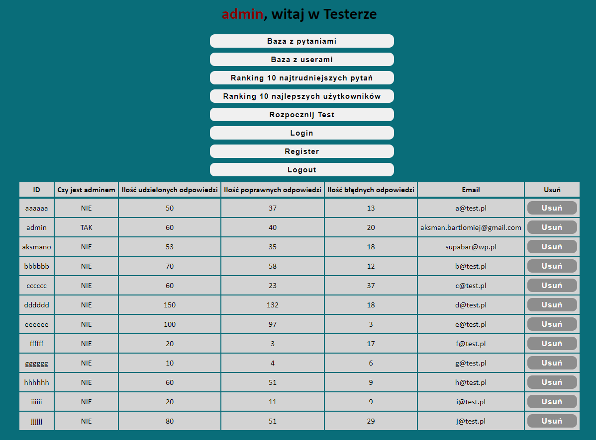

# Tester

Simple quiz app made in PHP

## Installation
After downloading import sql file into yours database and make sure is all files try to connect to yours. If not, you have to manually change values of connection variables. The default values are:
```
$servername = 'localhost';
$username = 'root';
$password = '';
$databas = 'tester';
```
If you are using xampp you have to paste the app into C:\xammp\installation\path\xammp\htdocs

## Instrucion
After launching the app you will be in the logging screen. You can log as administrator login: admin and password: admin. You can also login as normal user or register a new one.

Login panel


Admin panel

